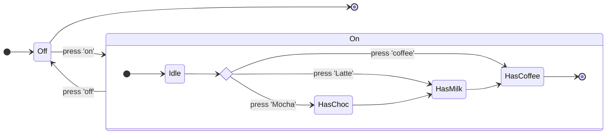
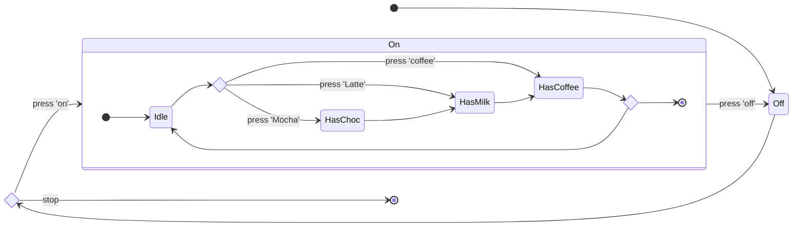
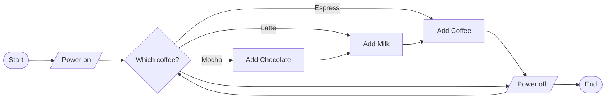
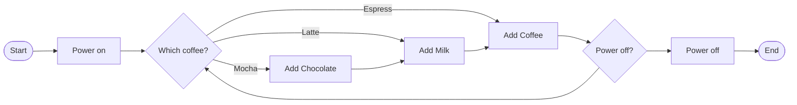
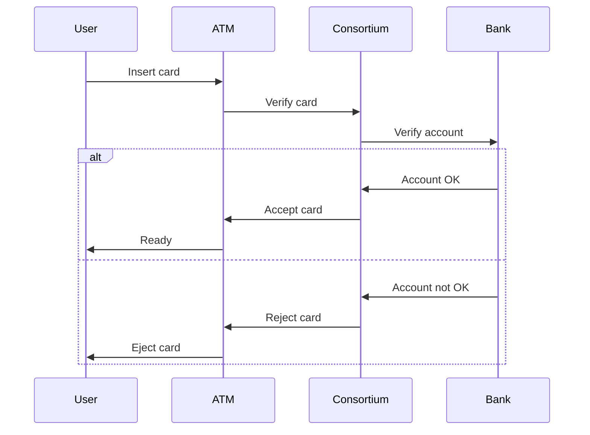

# Coffee state diagram



[link](https://mermaid-js.github.io/mermaid-live-editor/edit/#eyJjb2RlIjoic3RhdGVEaWFncmFtLXYyXG4gICAgZGlyZWN0aW9uIExSXG4gICAgWypdIC0tPiBPZmZcbiAgICBPbiAtLT4gT2ZmIDogcHJlc3MgJ29mZidcbiAgICBPZmYgLS0-IE9uIDogcHJlc3MgJ29uJ1xuICAgIE9mZiAtLT4gWypdXG5cbiAgICBzdGF0ZSBPbiB7XG4gICAgICAgIGRpcmVjdGlvbiBMUlxuICAgICAgICBbKl0gLS0-IElkbGVcbiAgICAgICAgc3RhdGUgcHJlc3MgPDxjaG9pY2U-PlxuICAgICAgICBJZGxlIC0tPiBwcmVzc1xuICAgICAgICBwcmVzcyAtLT4gSGFzQ2hvYyA6IHByZXNzICdNb2NoYSdcbiAgICAgICAgcHJlc3MgLS0-IEhhc01pbGsgIDogcHJlc3MgJ0xhdHRlJ1xuICAgICAgICBwcmVzcyAtLT4gSGFzQ29mZmVlIDogcHJlc3MgJ2NvZmZlZSdcbiAgICAgICAgSGFzQ2hvYyAtLT4gSGFzTWlsa1xuICAgICAgICBIYXNNaWxrIC0tPiBIYXNDb2ZmZWVcbiAgICAgICAgSGFzQ29mZmVlIC0tPiBbKl1cblxuICAgICAgICBcblxuICAgICAgICBcbiAgICB9IiwibWVybWFpZCI6IntcbiAgXCJ0aGVtZVwiOiBcImRlZmF1bHRcIlxufSIsInVwZGF0ZUVkaXRvciI6ZmFsc2UsImF1dG9TeW5jIjp0cnVlLCJ1cGRhdGVEaWFncmFtIjpmYWxzZX0)

[abc](https://)
(abc)[https://]




# Flow chart


[](https://mermaid-js.github.io/mermaid-live-editor/edit#eyJjb2RlIjoiZ3JhcGggTFJcbiAgICBBKFtTdGFydF0pIC0tPiBCWy9Qb3dlciBvbi9dO1xuICAgIEIgLS0-IEN7V2hpY2ggY29mZmVlP307XG4gICAgQyAtLU1vY2hhLS0-IENoW0FkZCBDaG9jb2xhdGVdXG4gICAgQyAtLUxhdHRlLS0-IE1rW0FkZCBNaWxrXVxuICAgIEMgLS1Fc3ByZXNzby0tPiBDZltBZGQgQ29mZmVlXVxuICAgIENoIC0tPiBNa1xuICAgIE1rIC0tPiBDZlxuICAgIENmIC0tPiBEe1ByZXNzIHBvd2VyP31cbiAgICBEIC0tPiBDXG4gICAgQyAtLT4gRFsvUG93ZXIgb2ZmL11cbiAgICBEIC0tPiBFKFtFbmRdKVxuXG4gICAgIiwibWVybWFpZCI6IntcbiAgXCJ0aGVtZVwiOiBcImRlZmF1bHRcIlxufSIsInVwZGF0ZUVkaXRvciI6ZmFsc2UsImF1dG9TeW5jIjp0cnVlLCJ1cGRhdGVEaWFncmFtIjpmYWxzZX0)


[](https://mermaid-js.github.io/mermaid-live-editor/edit#eyJjb2RlIjoiZ3JhcGggTFJcbiAgICBBKFtTdGFydF0pIC0tPiBCW1Bvd2VyIG9uXTtcbiAgICBCIC0tPiBDe1doaWNoIGNvZmZlZT99O1xuICAgIEMgLS1Nb2NoYS0tPiBDaFtBZGQgQ2hvY29sYXRlXVxuICAgIEMgLS1MYXR0ZS0tPiBNa1tBZGQgTWlsa11cbiAgICBDIC0tRXNwcmVzc28tLT4gQ2ZbQWRkIENvZmZlZV1cbiAgICBDaCAtLT4gTWtcbiAgICBNayAtLT4gQ2ZcbiAgICBDZiAtLT4gRHtQb3dlciBvZmY_fVxuICAgIEQgLS0-IENcbiAgICBEIC0tPiBEMltQb3dlciBvZmZdXG4gICAgRDIgLS0-IEUoW0VuZF0pXG5cbiAgICAiLCJtZXJtYWlkIjoie1xuICBcInRoZW1lXCI6IFwiZGVmYXVsdFwiXG59IiwidXBkYXRlRWRpdG9yIjpmYWxzZSwiYXV0b1N5bmMiOnRydWUsInVwZGF0ZURpYWdyYW0iOmZhbHNlfQ)


## Sequence diagrams



[link](https://mermaid-js.github.io/mermaid-live-editor/edit/#eyJjb2RlIjoic2VxdWVuY2VEaWFncmFtXG4gICAgVXNlciAtPj4gQVRNOiBJbnNlcnQgY2FyZFxuICAgIEFUTSAtPj4gQ29uc29ydGl1bTogVmVyaWZ5IGNhcmRcbiAgICBDb25zb3J0aXVtIC0-PiBCYW5rOiBWZXJpZnkgYWNjb3VudFxuICAgIGFsdFxuICAgIEJhbmsgLT4-IENvbnNvcnRpdW06IEFjY291bnQgT0tcbiAgICBDb25zb3J0aXVtIC0-PiBBVE06IEFjY2VwdCBjYXJkXG4gICAgQVRNIC0-PiBVc2VyOiBSZWFkeVxuICAgIGVsc2VcbiAgICBCYW5rIC0-PiBDb25zb3J0aXVtOiBBY2NvdW50IG5vdCBPS1xuICAgIENvbnNvcnRpdW0gLT4-IEFUTTogUmVqZWN0IGNhcmRcbiAgICBBVE0gLT4-IFVzZXI6IEVqZWN0IGNhcmRcbiAgICBlbmQiLCJtZXJtYWlkIjoie1xuICBcInRoZW1lXCI6IFwiZGVmYXVsdFwiXG59IiwidXBkYXRlRWRpdG9yIjpmYWxzZSwiYXV0b1N5bmMiOnRydWUsInVwZGF0ZURpYWdyYW0iOmZhbHNlfQ)


## Choreo for ATM example
```
user -> atm: InsertCard;
atm -> consortium: VerifyCard;
consortium -> bank: VerifyAccount;
(
bank -> consortium: AccountOK;
consortium -> atm: AcceptCard;
atm -> user: Ready
+
bank -> consortium: AccountNotOK;
consortium -> atm: RejectCard;
atm -> user: EjectCard
)
```